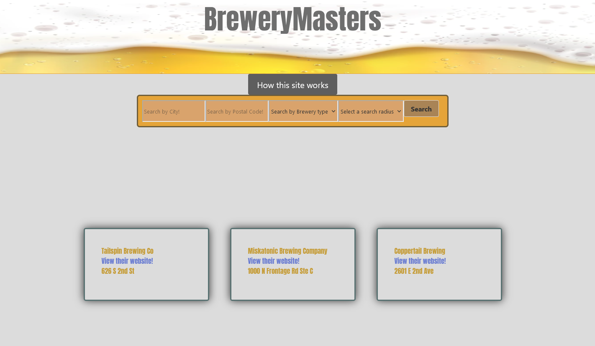

# BreweryMasters

## Table of Contents

  - [User Story](#user-story)
  - [Expected Behavior](#expected-behavior)
  - [Usage](#usage)
  - [Credits](#credits)
  - [License](#license)

***

##  User Story
- As a user I want a website to give me recommendations on breweries
- I want to be able to seach my city or zip to get breweries 
- I want to be able to filter by type of brewery 
- I want three locations given to me
- I want information about the breweries that are recommended to me 
- So that I can find new breweries in my area

***

## Expected Behavior 

Product gives users three brewery locations based on users searched criteria. 

***

## Usage

Here is what the website looks like. If you want to preview it click [HERE!](https://teeoni.github.io/SuperTeamRepo/)

***

## Credits

Each contributers assigned work with a link to their github profiles.

- [Byrcen](https://github.com/BrycenEhrich) : HTML
- [Jacob](https://github.com/jacobschwal) : HTML  
- [Charles](https://github.com/Brevenn) : CSS 
- [Scott](https://github.com/OvernightSolo) : CSS
- [Parker](https://github.com/ParksFG) : JS 
- [Tony](https://github.com/teeoni) : JS 

**

## License

This is free and unencumbered software released into the public domain.

Anyone is free to copy, modify, publish, use, compile, sell, or
distribute this software, either in source code form or as a compiled
binary, for any purpose, commercial or non-commercial, and by any
means.

In jurisdictions that recognize copyright laws, the author or authors
of this software dedicate any and all copyright interest in the
software to the public domain. We make this dedication for the benefit
of the public at large and to the detriment of our heirs and
successors. We intend this dedication to be an overt act of
relinquishment in perpetuity of all present and future rights to this
software under copyright law.

THE SOFTWARE IS PROVIDED "AS IS", WITHOUT WARRANTY OF ANY KIND,
EXPRESS OR IMPLIED, INCLUDING BUT NOT LIMITED TO THE WARRANTIES OF
MERCHANTABILITY, FITNESS FOR A PARTICULAR PURPOSE AND NONINFRINGEMENT.
IN NO EVENT SHALL THE AUTHORS BE LIABLE FOR ANY CLAIM, DAMAGES OR
OTHER LIABILITY, WHETHER IN AN ACTION OF CONTRACT, TORT OR OTHERWISE,
ARISING FROM, OUT OF OR IN CONNECTION WITH THE SOFTWARE OR THE USE OR
OTHER DEALINGS IN THE SOFTWARE.

For more information, please refer to <https://unlicense.org>
